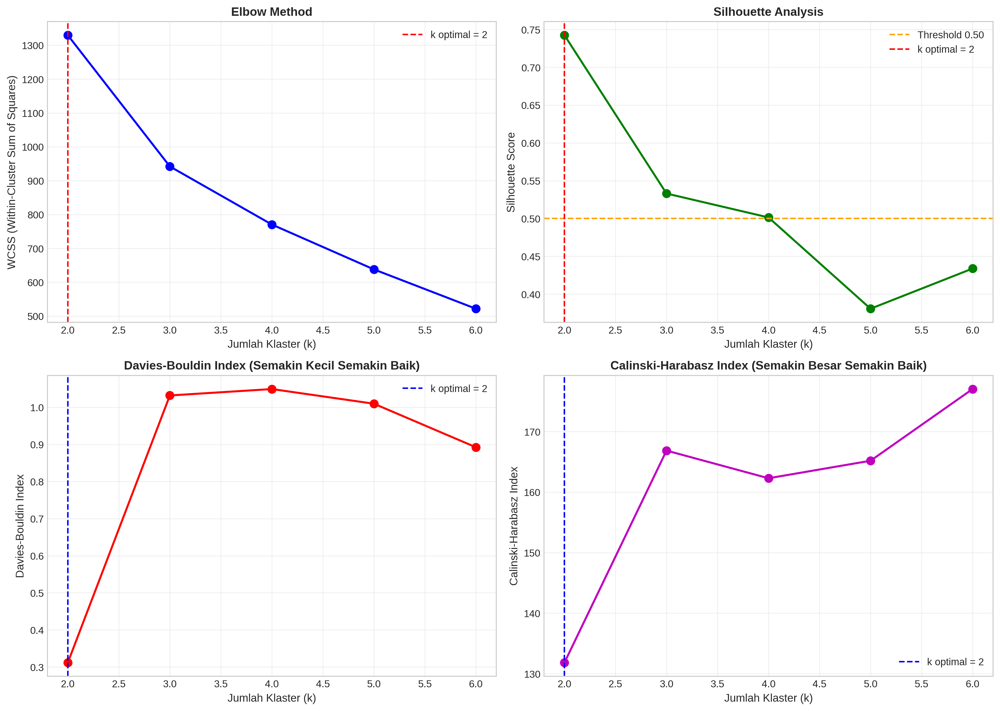
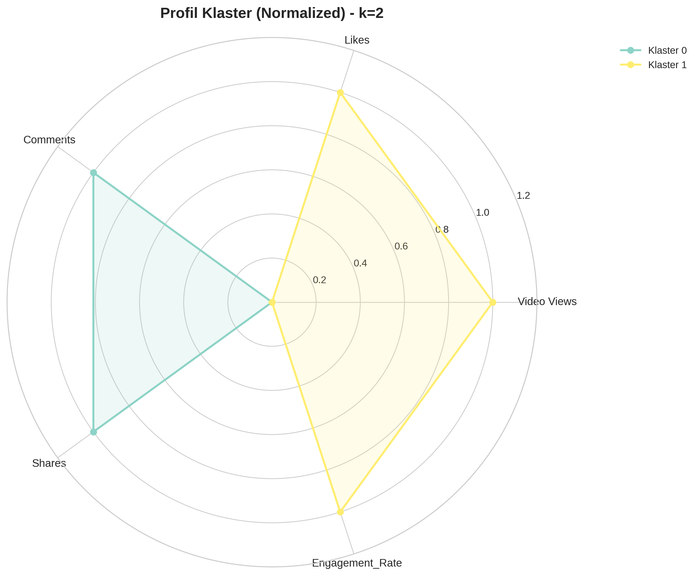
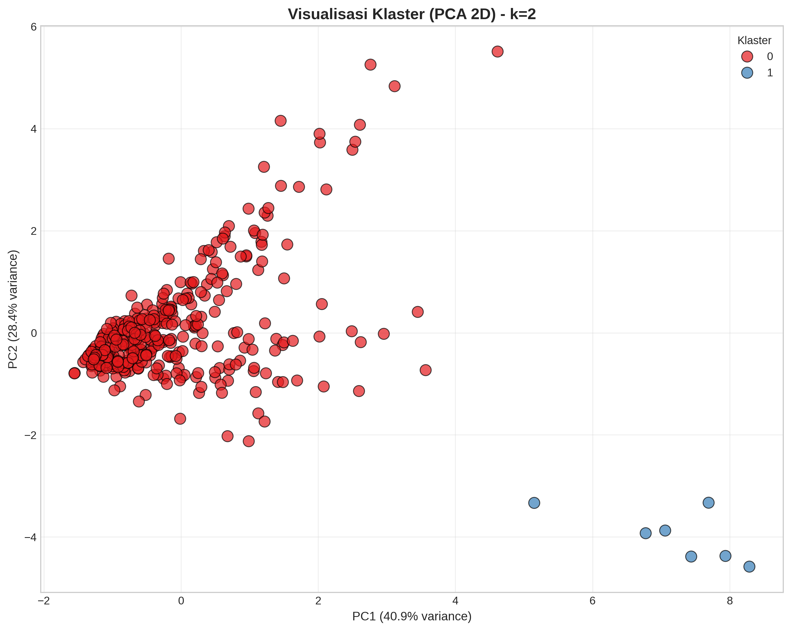

# kmeans-tiktok-segmentation
# 🎬 K-Means Clustering untuk Segmentasi Performa Konten TikTok
### 📊 Studi Kasus: Optimasi Strategi Pemasaran Digital UMKM (Perusahaan Kecap Djoe-Hoa)

<div align="center">


**Skripsi S1 Sistem Informasi • Universitas Harkat Negeri • 2026**

[📄 Lihat Skripsi Lengkap](#-tentang-penelitian) • [🔬 Lihat Hasil Analisis](#-hasil-utama) • [💻 Jalankan Kode](#-cara-menjalankan)

</div>

---

## 🌟 Ringkasan Eksekutif

Repository ini berisi **implementasi lengkap** dari penelitian skripsi yang menerapkan algoritma **K-Means Clustering** untuk melakukan segmentasi performa harian akun TikTok sebuah UMKM (Perusahaan Kecap Djoe-Hoa). 

Dengan menganalisis **363 hari observasi** (April 2025 – April 2026), penelitian ini berhasil mengungkap pola tersembunyi yang tidak terlihat oleh analisis rata-rata biasa, dan menghasilkan rekomendasi strategi pemasaran digital yang **terukur, kontekstual, dan berbasis data**.

### 🎯 Temuan Paling Menarik
> 💡 **"Views tinggi TIDAK otomatis berarti Engagement tinggi!"**
> 
> Klaster konten viral memiliki *Engagement Rate* **10× lebih tinggi** (3,16% vs 0,31%) meskipun jumlah *Views*-nya hampir identik dengan konten biasa. Ini membuktikan bahwa **kualitas emosional konten** jauh lebih penting daripada sekadar jangkauan algoritmik.

---

## 📋 Daftar Isi

- [Tentang Penelitian](#-tentang-penelitian)
- [Hasil Utama](#-hasil-utama)
- [Struktur Repository](#-struktur-repository)
- [Tech Stack](#-tech-stack)
- [Cara Menjalankan](#-cara-menjalankan)
- [Output yang Dihasilkan](#-output-yang-dihasilkan)
- [Visualisasi](#-visualisasi)
- [Kontribusi](#-kontribusi)
- [Lisensi](#-lisensi)
- [Kontak](#-kontak)

---

## 📖 Tentang Penelitian

### Latar Belakang
TikTok telah menjadi platform pemasaran digital yang sangat potensial di Indonesia dengan lebih dari **160 juta pengguna aktif**. Namun, banyak pelaku UMKM masih mengandalkan pendekatan *trial-and-error* dalam menyusun strategi konten karena tidak memiliki framework analitik yang objektif.

### Rumusan Masalah
1. Bagaimana mempersiapkan data agregat harian TikTok untuk proses *clustering*?
2. Berapa jumlah klaster optimal yang terbentuk?
3. Apa karakteristik setiap klaster performa?
4. Bagaimana merekomendasikan strategi pemasaran digital berbasis hasil segmentasi?

### Metodologi
Penelitian ini menggunakan pendekatan **Data Mining** dengan paradigma **Unsupervised Learning**, khususnya algoritma **K-Means Clustering**. Pipeline analisis mengikuti standar **CRISP-DM** yang meliputi:

```
📥 Data Collection → 🧹 Data Cleaning → ⚙️ Feature Engineering → 
📏 Normalization → 🎯 K-Means Clustering → 📊 Evaluation → 
💡 Strategic Recommendations → ✅ Expert Judgement Validation
```

---

## 🏆 Hasil Utama

### 📊 Metrik Evaluasi Model
| Metrik | Nilai | Interpretasi |
|--------|-------|--------------|
| **Silhouette Score** | **0.7424** | Struktur klaster SANGAT KUAT (>0.70) ✅ |
| **Davies-Bouldin Index** | **0.3120** | Klaster sangat kompak & terpisah (mendekati 0) ✅ |
| **Calinski-Harabasz Index** | **131.83** | Separasi antar klaster baik ✅ |
| **Jumlah Klaster Optimal (k)** | **2** | Berdasarkan Elbow + Silhouette Analysis |

### 🎯 Profil Klaster yang Terbentuk

| Karakteristik | Klaster 0 (Low Engagement) | Klaster 1 (High Engagement) |
|---------------|---------------------------|----------------------------|
| **Jumlah Hari** | 356 hari (98,1%) | 7 hari (1,9%) |
| **Rata-rata Video Views** | 4.448 | 4.609 |
| **Rata-rata Likes** | 12,2 | **145,4** (12× lebih tinggi!) |
| **Engagement Rate** | 0,31% | **3,16%** (10× lebih tinggi!) |
| **Rata-rata Comments** | 0,87 | 0,29 |
| **Rata-rata Shares** | 0,77 | 0,29 |

### 🔍 Temuan Kunci (Key Insights)

1. **🎭 Fenomena "Dekoupling"**: Lonjakan *Engagement* pada Klaster 1 **TIDAK** didorong oleh peningkatan *Views*, melainkan oleh kualitas konten yang memicu respons emosional audiens.

2. **👍 Interaksi Apresiatif-Pasif**: Konten viral di Klaster 1 berhasil memicu banyak *Likes* impulsif, namun **kurang efektif** dalam mendorong *Comments* dan *Shares*. Ini mengindikasikan konten lebih bersifat "menghibur" daripada "memancing diskusi".

3. **⚖️ Anomali Centroid**: Meskipun Klaster 1 unggul di *Likes* dan *Engagement Rate*, nilai centroid untuk *Comments* (-0,40) dan *Shares* (-0,34) justru **lebih rendah** dari Klaster 0.

### 💡 Rekomendasi Strategis yang Divalidasi

Rekomendasi telah divalidasi melalui **Expert Judgement** dengan pemilik usaha dan tim pemasaran, menghasilkan skor rata-rata **4,58/5,00** (kategori "Sangat Layak").

**Untuk Klaster 0 (Low Engagement):**
- 🎣 Optimasi *hook* 3-5 detik pertama video
- 📢 Tambahkan CTA eksplisit untuk memancing interaksi
- 🎨 Eksperimen format baru (tutorial, behind-the-scene)

**Untuk Klaster 1 (High Engagement):**
- 🔬 *Reverse-engineering* formula 7 hari viral
- 🔄 Konversi interaksi pasif ke aktif dengan CTA spesifik ("tag teman", "bagikan jika setuju")
- 💰 Alokasi budget promosi (*TikTok Ads*) untuk konten tipe ini
- 📝 Dokumentasi blueprint kreatif untuk replikasi massal

---

## 📁 Struktur Repository

```
📦 kmeans-tiktok-segmentation/
├── 📄 README.md                    # Dokumentasi utama (file ini)
├── 📄 .gitignore                   # File yang diabaikan Git
├── 📄 requirements.txt             # Daftar dependencies Python
│
├── 📂 data/                        # Dataset mentah (CSV)
│   ├── Overview_April-Des2025.csv
│   ├── Overview_Jan-April2026.csv
│   └── Viewers.csv
│
├── 📂 notebooks/                   # Jupyter Notebook analisis
│   └── kmeans_tiktok_analysis.ipynb
│
├── 📂 outputs/                     # Hasil analisis
│   ├── profil_klaster.csv
│   ├── hasil_clustering_lengkap.csv
│   ├── ringkasan_hasil.csv
│   ├── evaluasi_k_optimal.png
│   ├── radar_chart_klaster.png
│   ├── bar_chart_klaster.png
│   └── scatter_plot_pca.png
│
└── 📂 docs/                        # Dokumentasi pendukung
    ├── skripsi_full.pdf
    └── presentasi_sidang.pdf
```

---

## 🛠️ Tech Stack

| Kategori | Tools/Library | Versi |
|----------|---------------|-------|
| **Bahasa** | Python | 3.10+ |
| **Data Processing** | Pandas, NumPy | 2.0+ |
| **Machine Learning** | Scikit-Learn | 1.3+ |
| **Visualisasi** | Matplotlib, Seaborn | Latest |
| **Environment** | Jupyter Notebook / VS Code | Latest |

---

## 🚀 Cara Menjalankan

### 1. Clone Repository
```bash
git clone https://github.com/username/kmeans-tiktok-segmentation.git
cd kmeans-tiktok-segmentation
```

### 2. Buat Virtual Environment (Opsional tapi Direkomendasikan)
```bash
python -m venv venv
source venv/bin/activate  # Linux/Mac
venv\Scripts\activate     # Windows
```

### 3. Install Dependencies
```bash
pip install -r requirements.txt
```

Atau install manual:
```bash
pip install pandas numpy matplotlib seaborn scikit-learn jupyter
```

### 4. Jalankan Notebook
```bash
jupyter notebook notebooks/kmeans_tiktok_analysis.ipynb
```

Atau jalankan sebagai script Python:
```bash
python notebooks/kmeans_tiktok_analysis.ipynb
```

### 5. Lihat Hasil
Semua output (CSV dan gambar visualisasi) akan tersimpan otomatis di folder `outputs/`.

---

## 📤 Output yang Dihasilkan

Setelah menjalankan notebook, Anda akan mendapatkan:

### 📊 File CSV
- **`profil_klaster.csv`** → Rata-rata metrik per klaster
- **`hasil_clustering_lengkap.csv`** → Dataset lengkap dengan label klaster
- **`ringkasan_hasil.csv`** → Ringkasan metrik evaluasi model

### 📈 Visualisasi
- **`evaluasi_k_optimal.png`** → Grafik Elbow, Silhouette, DBI, CHI
- **`radar_chart_klaster.png`** → Profil multidimensi klaster
- **`bar_chart_klaster.png`** → Perbandingan metrik per klaster
- **`scatter_plot_pca.png`** → Visualisasi 2D klaster dengan PCA

---

## 🎨 Visualisasi

### Grafik Evaluasi Jumlah Klaster Optimal

*Penentuan k=2 sebagai klaster optimal berdasarkan 4 metrik evaluasi*

### Radar Chart Profil Klaster

*Perbandingan profil multidimensi antara Klaster 0 dan Klaster 1*

### Visualisasi PCA 2D

*Pemisahan yang sangat jelas antara kedua klaster dalam ruang 2 dimensi*

---

## 🤝 Kontribusi

Kontribusi sangat dihargai! Jika Anda ingin berkontribusi:

1. **Fork** repository ini
2. Buat **branch** fitur baru (`git checkout -b feature/AmazingFeature`)
3. **Commit** perubahan Anda (`git commit -m 'Add some AmazingFeature'`)
4. **Push** ke branch (`git push origin feature/AmazingFeature`)
5. Buka **Pull Request**

---

## 📜 Lisensi

Distributed under the MIT License. See `LICENSE` for more information.

---

## 📧 Kontak

**Peneliti:** Ayu Kartika  
**NIM:** 22166020  
**Program Studi:** S1 Sistem Informasi  
**Fakultas:** Sains dan Teknologi  
**Universitas:** Universitas Harkat Negeri  


---

## 🙏 Acknowledgments

- **Dosen Pembimbing 1:** Sarif Surorejo, S.E., M.Kom
- **Dosen Pembimbing 2:** Slamet Wiyono, M.Eng
- **Perusahaan Kecap Djoe-Hoa** — atas izin akses data dan validasi expert judgement
- **Program Studi S1 Sistem Informasi, Universitas Harkat Negeri**

---

<div align="center">

### ⭐ Jika repository ini bermanfaat, jangan lupa berikan bintang! ⭐

**"In God We Trust. All Others Must Bring Data."** — W. Edwards Deming

Made with ❤️ and 🐍 Python

</div>
